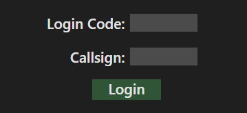
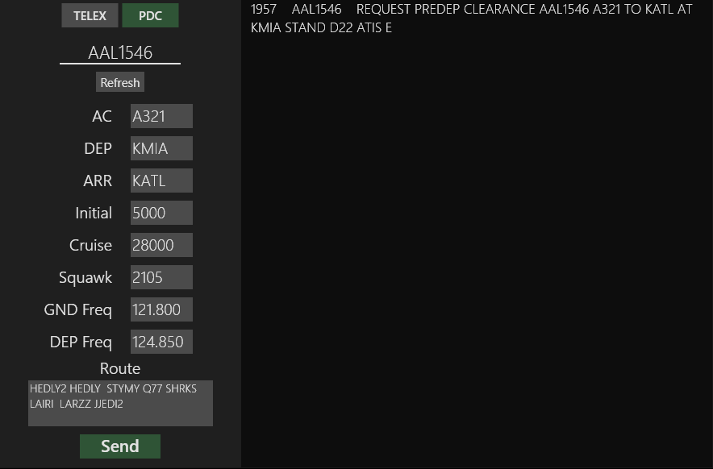
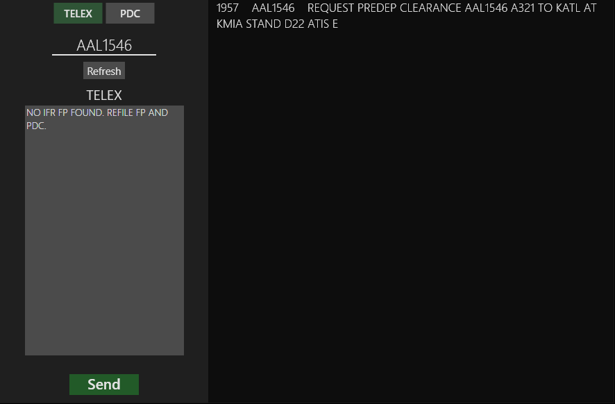

# Delivery Link
Delivery Link is a ACARS PDC interface for the VATSIM network.

## Installation
To install Delivery Link, download the [latest release](https://github.com/migte/Delivery-Link/releases/latest).

## Usage
Before using Delivery Link, you need to create a Hoppie ACARS account to recieve your login code. That can be done [here](http://www.hoppie.nl/acars/system/register.html)

### Login

Here you must enter the login code you created on the Hoppie website and your facility callsign. For example, if you are running Boston, you callsign would be KBOS.

### Operating the interface

On the right you will see the inbound message log. Here, incomming requests will appear. A noise will indicate the arrival of a new message. You can left click the message to laod it into your flight plan editor, and you can right click a message to delete it. 

On the left, you will see the flight plan editor. Here, you can adjust all the information in your PDC, from the callsign of the aircraft you will be sending it to, to the individual componenets of the flight plan you will be clearing them for. When a message is loaded, available flight plan information from the callsign that sent the message will be loaded into it's corresponding inputs. If you need to refresh this information, or none appeared in the first place, you may hit the refresh button to try again. Please keep in mind, the vatsim API only updates about every 15 seconds.

The submit button will send the PDC to the user and remove the message from the message log.

### TELEX

By selecting the "TELEX" at the top, you may open the TELEX page. You can return to the PDC page by selecting "PDC". Here, you can send free form TELEX messages to an aircraft. Just type in the callsign (or select the message they sent), write your message, and hit send.

